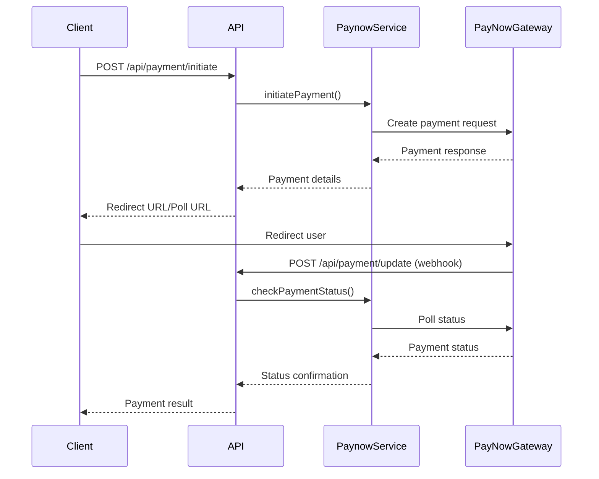

# PayNow Integration Demo

A simple demonstration of PayNow integration in a Next.js e-commerce application.

## Payment Flow

1. **Customer Checkout**
   - Customer adds items to cart
   - Fills in their details at checkout
   - Chooses payment method (Web or Mobile Money)

2. **Web Payment Flow**
   ```js
   // Create payment on PayNow
   const payment = paynow.createPayment(reference, email);
   
   // Add items
   payment.add("Product Name", price);
   
   // Get payment URL
   const response = await paynow.send(payment);
   
   // Redirect customer
   window.location.href = response.redirectUrl;
   ```

3. **Mobile Money Flow**
   ```js
   // Create payment on PayNow
   const payment = paynow.createPayment(reference, email);
   
   // Add items
   payment.add("Product Name", price);
   
   // Send to mobile money
   const response = await paynow.sendMobile(
     payment, 
     phoneNumber, 
     'ecocash'
   );
   
   // Show instructions to customer
   alert(response.instructions);
   ```

4. **Payment Updates**
   - PayNow sends payment status to: `/api/payment/update`
   - Success redirects to: `/payment/success`
   - Failures redirect to: `/payment/failed`

## Setup

1. Install dependencies:
   ```bash
   npm install
   ```

2. Add PayNow credentials in `.env.local`:
   ```
   NEXT_PUBLIC_PAYNOW_INTEGRATION_ID=YOUR_ID
   NEXT_PUBLIC_PAYNOW_INTEGRATION_KEY=YOUR_KEY
   ```

3. Run the development server:
   ```bash
   npm run dev
   ```

## Testing

Use PayNow's test credentials for development:
- Integration ID: `INTEGRATION_ID`
- Integration Key: `INTEGRATION_KEY`

For mobile money testing, use:
- EcoCash: `+263771234567`
- OneMoney: `+263731234567`

## Learn More

- [PayNow Documentation](https://developers.paynow.co.zw/docs)
- [Next.js Documentation](https://nextjs.org/docs)

## Payment Flow Architecture



## Key Components

### 1. Payment Initiation (`/api/payment/initiate`)
- Handles both web and mobile payments
- Validates request payload
- Converts cart items to PayNow format
- Returns payment redirect URL or mobile instructions

### 2. Payment Update Webhook (`/api/payment/update`)
- Receives PayNow payment status updates
- Verifies payment authenticity
- Updates order status in database
- Triggers confirmation emails

### 3. Paynow Service (`services/paynow.ts`)
Core payment processing logic:
- `initiateWebPayment()`: Credit card/bank payments
- `initiateMobilePayment()`: Mobile money payments
- `checkPaymentStatus()`: Poll payment status
- Handles currency conversions (USD to cents)
- Generates unique transaction references

### 4. Checkout Components
- `pages/checkout.tsx`: Payment form UI
- `pages/payment/success.tsx`: Success page
- `pages/payment/failed.tsx`: Failed payment page

## Environment Variables
```ini
NEXT_PUBLIC_PAYNOW_INTEGRATION_ID=your_integration_id
NEXT_PUBLIC_PAYNOW_INTEGRATION_KEY=your_integration_key
NEXT_PUBLIC_PAYNOW_MERCHANT_EMAIL=registered@email.com
PAYNOW_RESULT_URL=http://localhost:3000/api/payment/update
PAYNOW_RETURN_URL=http://localhost:3000/payment/success
```

## Error Handling
- Automatic retries for network errors
- Detailed error logging
- User-friendly error messages
- Fallback UI states
- Transaction status verification

## Security
- All sensitive operations server-side
- HTTPS enforced
- Payment data never stored
- CSRF protection
- Input validation
- Secure credential storage
